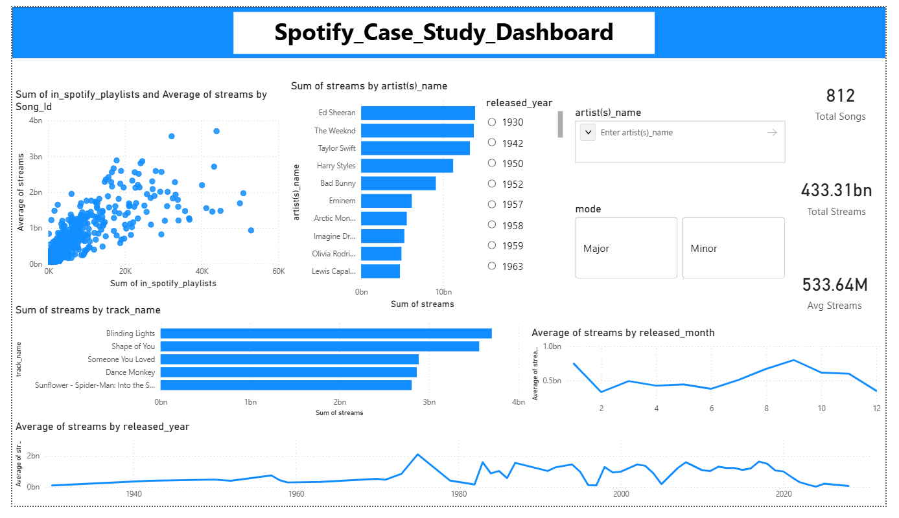

# Spotify Song Popularity Analysis

##  Project Overview

This project analyzes what drives song popularity in the digital music industry using data from Spotify, Apple Music, and Deezer.

The goal is to identify key factors influencing song success and provide actionable insights using data analytics, machine learning, and visualization.


## Objectives

- Identify key drivers of song popularity  
- Analyze trends across time and platforms  
- Evaluate the impact of audio features  
- Build predictive models to validate insights  
- Create an interactive dashboard  


## Dataset

The dataset includes:

- Song metadata (artist, release date, key, mode)  
- Platform metrics (playlists, charts)  
- Audio features (danceability, energy, etc.)  


##  Data Processing

- Data cleaning and preprocessing  
- Handling missing values  
- Removing duplicate `Song_Id` entries  
- Feature engineering (`log_streams`)  
- Data normalization  


##  Key Analysis

### 🔹 Distribution Analysis
- Highly right-skewed distribution  
- Few songs dominate total streams  

### 🔹 Correlation Analysis
- Playlist features show strongest correlation with streams  
- Audio features have weak impact  

### 🔹 Temporal Trends
- Peak performance observed in Aug–Sep  
- Popularity is hit-driven rather than consistent  

### 🔹 Artist Insights
- Global artists dominate top charts  
- Collaborations improve reach  


##  Machine Learning

| Model | R² Score |
|------|--------|
| Linear Regression | 0.51 |
| Random Forest | 0.77 |

Random Forest performs better, indicating non-linear relationships in the data.


## Dashboard

An interactive Power BI dashboard was created to visualize:

- KPI metrics (Total Streams, Avg Streams, Total Songs)  
- Top songs and artists  
- Temporal trends (year & month)  
- Playlist vs streams relationship  
- Interactive slicers for filtering  

Preview:  



##  Installation & Requirements

To run this project locally, install the required Python libraries using:

```bash
pip install -r requirements.txt 


